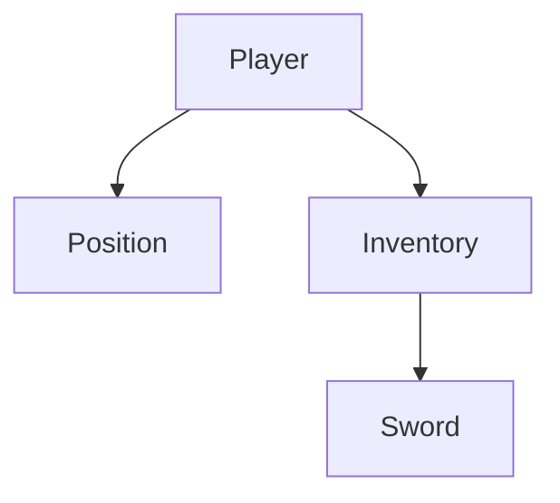

# PicoEntityStore

PicoEntityStore is a fast, thread-safe, and simple library for managing entities and their relationships.

---

## 📖 1. Full API Reference

```csharp
public sealed class PicoEntityStore
{
    public int Count { get; }
    
    // Lifecycle
    public void Add(PicoEntity parent, params PicoEntity[] children);
    public void Remove(params PicoEntity[] entities);
    public void Clear();

    // Retrieval
    public T? Get<T>(uint id) where T : PicoEntity;
    public T? First<T>() where T : PicoEntity;
    public List<PicoEntity> All();
    public List<T> All<T>() where T : PicoEntity;

    // Iteration
    public void ForEach(Action<PicoEntity> action);
    public void ForEach<T>(Action<T> action) where T : PicoEntity;

    // Navigation
    public PicoEntity? Parent(PicoEntity entity);
    public List<PicoEntity> Children(PicoEntity parent);
    public List<PicoEntity> Descendants(PicoEntity parent);
}
```

---

## 🚀 2. Getting Started

### 2.1 Define Your Entities
Entities are simple classes that inherit from `PicoEntity`. Each entity automatically receives a unique `Id`.

```csharp
public class Player : PicoEntity { public string Name { get; set; } = "Hero"; }
public class Position : PicoEntity { public float X, Y; }
public class Inventory : PicoEntity { }
public class Sword : PicoEntity { }
```

### 2.2 Initialize the Store
The `PicoEntityStore` is the central hub for all your entities.

```csharp
using PicoEntityStore;

var store = new PicoEntityStore();
```

### 2.3 Basic Operations
Add, retrieve, and remove entities in $O(1)$ time.

```csharp
var player = new Player();

// Add to store
store.Add(player);

// Retrieve by ID
var samePlayer = store.Get<Player>(player.Id);

// Remove from store
store.Remove(player);
```

---

## 🌳 3. Hierarchy & Relationships

PicoEntityStore excels at managing nested relationships. When you add entities, you can establish parent-child links immediately.

### 3.1 Creating a Hierarchy
You can add multiple children to a parent in a single call.

```csharp
var player = new Player();
var inventory = new Inventory();
var position = new Position();
var sword = new Sword();

// 'inventory' and 'position' become children of 'player'
store.Add(player, inventory, position);

// 'sword' becomes a child of 'inventory'
store.Add(inventory, sword);
```

### 3.2 Visualizing the Tree
The above code creates the following structure:



### 3.3 Recursive Removal
Removing a parent entity **automatically removes all its descendants**. This ensures no "ghost" entities are left in the store when a root object is destroyed.

```csharp
// This removes the player, inventory, position, AND the sword.
store.Remove(player); 
```

---

## 🔍 4. Querying & Iteration

### 4.1 Efficient Iteration with `ForEach`
Use `ForEach<T>` to execute logic on all entities of a specific type. 

> **Performance Tip:** `ForEach<T>` uses **exact type matching** for $O(1)$ lookup speed. It is significantly faster than filtering a large list with LINQ.

```csharp
store.ForEach<Position>(p => {
    p.X += 1.0f;
});
```

---

## 🧪 More Examples
For more examples, explore the test suite:
👉 **[PicoEntityStore.Tests/StoreApiTests.cs](./PicoEntityStore.Tests/StoreApiTests.cs)**

## ⚖️ License
This project is licensed under the MIT License - see the [LICENSE](LICENSE) file for details.
