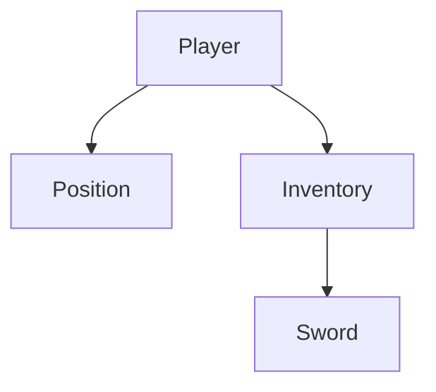

# PicoEntityStore

PicoEntityStore is a fast, thread-safe, and simple library for managing entities and their relationships.

---

## 📖 1. Full API Reference

```csharp
public sealed class PicoEntityStore
{
    public int Count { get; }
    
    // Lifecycle
    public void Add(PicoEntity parent, params PicoEntity[] children);
    public void Remove(params PicoEntity[] entities);
    public void Clear();

    // Retrieval
    public T? Get<T>(uint id) where T : PicoEntity;
    public T? First<T>() where T : PicoEntity;
    public List<PicoEntity> All(params Type[] types);

    // Navigation
    public PicoEntity? Parent(PicoEntity entity);
    public List<PicoEntity> Children(PicoEntity parent);
    public List<PicoEntity> Descendants(PicoEntity parent);
}
```

---

## 🚀 2. Getting Started

### 2.1 Define Your Entities
Entities are simple classes that inherit from `PicoEntity`. Each entity automatically receives a unique `Id`.

```csharp
public class Player : PicoEntity { public string Name { get; set; } = "Hero"; }
public class Position : PicoEntity { public float X, Y; }
public class Inventory : PicoEntity { }
public class Sword : PicoEntity { }
```

### 2.2 Initialize the Store
The `PicoEntityStore` is the central hub for all your entities.

```csharp
using PicoEntityStore;

var store = new PicoEntityStore();
```

### 2.3 Basic Operations
Add, retrieve, and remove entities in $O(1)$ time.

```csharp
var player = new Player();

// Add to store
store.Add(player);

// Retrieve by ID
var samePlayer = store.Get<Player>(player.Id);

// Remove from store
store.Remove(player);
```

---

## 🌳 3. Hierarchy & Relationships

PicoEntityStore excels at managing nested relationships. When you add entities, you can establish parent-child links immediately.

### 3.1 Creating a Hierarchy
You can add multiple children to a parent in a single call.

```csharp
var player = new Player();
var inventory = new Inventory();
var position = new Position();
var sword = new Sword();

// 'inventory' and 'position' become children of 'player'
store.Add(player, inventory, position);

// 'sword' becomes a child of 'inventory'
store.Add(inventory, sword);
```

### 3.2 Visualizing the Tree
The above code creates the following structure:



### 3.3 Recursive Removal
Removing a parent entity **automatically removes all its descendants**. This ensures no "ghost" entities are left in the store when a root object is destroyed.

```csharp
// This removes the player, inventory, position, AND the sword.
store.Remove(player); 
```

---

## 🔍 4. Querying

You can query items by fetching `All()` matching entities.

```csharp
var items = store.All(typeof(Position));
foreach(Position p in items) {
    p.X += 1.0f;
}
```

---

## 🧪 More Examples
For more examples, explore the test suite:
👉 **[PicoEntityStore.Tests/StoreApiTests.cs](./PicoEntityStore.Tests/StoreApiTests.cs)**

## 📊 Performance Benchmarks (120 FPS Target)

The following benchmarks demonstrate the performance of `PicoEntityStore` methods within the context of a high-performance game running at **120 FPS** (8.33ms / 8,333,333 ns frame budget).

**Hardware & Environment:**
* **Date:** March 31, 2026
* **OS:** Windows 11
* **CPU:** 13th Gen Intel Core i9-13980HX (32 logical cores)
* **Runtime:** .NET 10.0

| Operation | Scale / Setup | Mean Execution Time | Ops per Frame (120 FPS) |
| :--- | :--- | :--- | :--- |
| **Add** | Bulk add 10,000 entities | ~520.88 µs | **16** |
| **Get\<T\>** | Retrieve single entity | ~10.32 ns | **807,493** |
| **Descendants**| Traverse 100 deep hierarchy| ~1.05 µs | **7,936** |
| **All** | Retrieve 10,000 entities | ~3.24 µs | **2,571** |
| **All(Type)** | Filter 10,000 entities | ~1.73 µs | **4,816** |
| **First\<T\>** | Retrieve first entity | ~11.34 ns | **734,861** |
| **Remove** | Remove 100 entities | ~19.88 µs | **419** |

*Note: "Ops per Frame" indicates how many times the exact operation (including its internal loops over the specified scale) can be executed within a single 8.33ms frame.*

## ⚖️ License
This project is licensed under the MIT License - see the [LICENSE](LICENSE) file for details.

IT License - see the [LICENSE](LICENSE) file for details.

